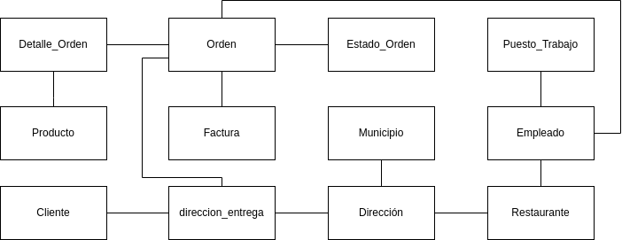
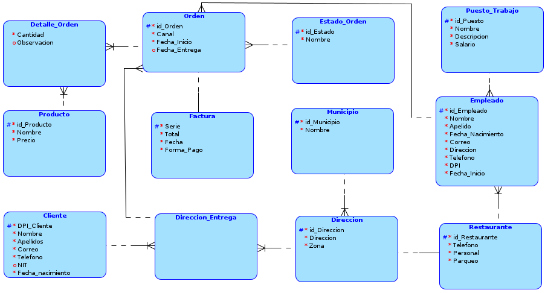
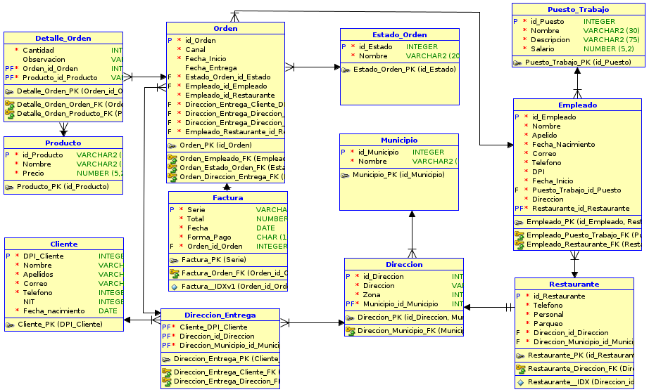

# SBD1_Proyecto2
Proyecto del curso Sistemas de bases de datos 1, primer semestre 2023

|            Nombre          |  Carnet   |
| -------------------------- | --------- |
| Carlos Daniel Acabal Pérez | 202004724 |

El presente manual describe cómo funcionan los modelos utilizados, scripts sql y la base de datos usada

## Requisitos
- [MySQL](https://www.mysql.com/downloads/)

#### Scripts SQL
Todas las sentencias DML y DDL se encuentran en scripts sql:
- [Base de datos](./scripts/DB.sql)
- [Triggers](./scripts/Triggers.sql)
- [Funcionalidades](./scripts/Funcionalidades.sql)
- [Reportes](./scripts/Reportes.sql)

Es necesario que los scripts sean importados a la base de datos en el orden que fueron listados.
### Base de datos
La base de datos utilizada fue MySQL, para ello se usó [Xampp](https://www.apachefriends.org/download.html)
### Modelos para base de datos
Se utilizó la herramienta [draw.io](https://app.diagrams.net/) para crear el modelo conceptual, además se utilizó la herramienta [Data Modeler](https://www.oracle.com/database/sqldeveloper/technologies/sql-data-modeler/download/) para el modelo lógico y relacional
#### Modelo conceptual

#### Modelo lógico

#### Modelo relacional

